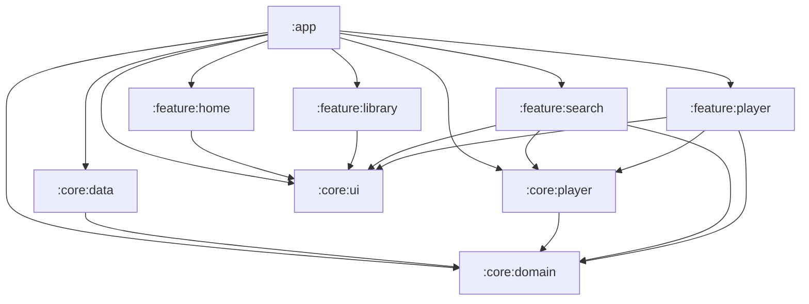

# Resona module architecture

Resona is split into nine Gradle modules so that frontend work (feature
screens, design system) can happen without touching or understanding the
backend (networking, database, playback engine).

## Module graph

Arrows point from a module to what it depends on. Nothing points back up:
`:core:domain` depends on nothing, and no `:feature:*` module depends on
another `:feature:*` module or on `:core:data` directly.

## Modules

| Module | Type | Depends on | Contains |
|---|---|---|---|
| `:app` | Android application | everything | `MainActivity`, `ResonaApplication`, `NavGraph`/`Destinations`, the three Hilt `@Module`s (`AppModule`, `NetworkModule`, `RepositoryModule`) |
| `:core:domain` | Kotlin/JVM (no Android) | — | `Song`, `MusicRepository` interface, `PlaybackUnavailableException`/`StreamCipherRequiredException` |
| `:core:data` | Android library | `:core:domain` | InnerTube/Ktor networking (`InnerTubeApi`, response models), `MusicRepositoryImpl`. Room would live here too if/when it's added. |
| `:core:player` | Android library | `:core:domain` | `PlayerService` (ExoPlayer + MediaSession foreground service), `PlayerViewModel`/`PlayerUiState` |
| `:core:ui` | Android library (Compose) | — | Theme, colors, typography, shapes, shared composables (`ResonaFilledButton`, `ResonaOutlinedButton`, `ResonaPlaceholderScreenContent`) |
| `:feature:home` | Android library (Compose) | `:core:ui` | `HomeScreen` |
| `:feature:search` | Android library (Compose) | `:core:domain`, `:core:ui`, `:core:player` | `SearchScreen`, `SearchViewModel` |
| `:feature:player` | Android library (Compose) | `:core:domain`, `:core:ui`, `:core:player` | `NowPlayingScreen`, `MiniPlayerBar` |
| `:feature:library` | Android library (Compose) | `:core:ui` | `LibraryScreen` |

`:core:domain` is a plain `kotlin("jvm")` module, not an Android library --
it cannot reference `android.*` or `androidx.*` at all, which is what
actually enforces "zero Android framework dependencies" rather than just
documenting it.

## Enforced dependency rules

1. **Feature modules never depend on `:core:data`.** They only see
   `MusicRepository` (the interface, from `:core:domain`), never
   `MusicRepositoryImpl`, `InnerTubeApi`, or anything network/database-shaped.
   Gradle enforces this the same way it enforces any other missing
   dependency: if a `:feature:*` module tries to import something from
   `:core:data`, it won't compile until someone adds that dependency edge --
   which should be a deliberate, reviewable decision, not an accident.
2. **`:core:domain` has zero Android dependencies**, enforced by it being a
   `kotlin("jvm")` module rather than `com.android.library` -- there's no
   Android SDK on its compile classpath to accidentally depend on.
3. **Only `:app` declares `@Module`/`@Provides`/`@Binds`.** `RepositoryModule`
   (binds `MusicRepositoryImpl` to `MusicRepository`) and `NetworkModule`
   (builds the actual Ktor `HttpClient`) both live in `:app`, even though the
   classes they reference live in `:core:data`. This is the one place the
   "backend" and "frontend" sides of the graph are explicitly wired together.

   One nuance worth knowing: `:core:data`, `:core:player`, and
   `:feature:search` still each have Hilt's `kapt`/`hilt-android` applied,
   because `MusicRepositoryImpl`, `InnerTubeApi`, `PlayerViewModel`, and
   `SearchViewModel` all use `@Inject constructor`/`@HiltViewModel`, and
   Dagger's annotation processor has to run in the module where those are
   *declared* to generate their factory classes. That's different from
   *wiring* (deciding which concrete class satisfies which interface, via
   `@Module`), which is rule 3 above and is what stays exclusive to `:app`.
   See `CONTRIBUTING.md` if this distinction matters for what you're doing.

## Package names vs. module paths

Kotlin package names were **not** renamed as part of this split --
`com.resona.music.domain.model.Song` still lives at that same package, just
physically inside `:core:domain` now instead of `:app`. Only each module's
Gradle/AGP `namespace` (used for that module's own generated `R` class) is
distinct, e.g. `:core:player`'s is `com.resona.music.core.player`, even
though the Kotlin files inside it are still `package com.resona.music.playback`.
This was a deliberate choice to keep the diff to "move files, fix the
handful of resource imports that crossed a module boundary" rather than
rewriting every import in the codebase; a full package rename is possible
later but is a separate, much larger change.
