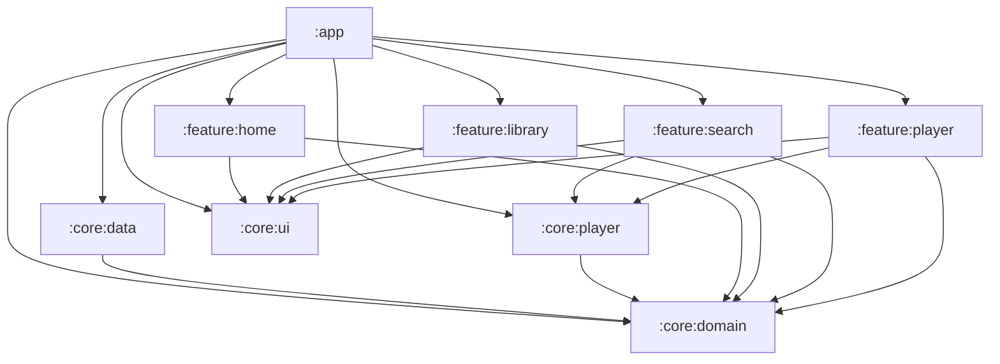
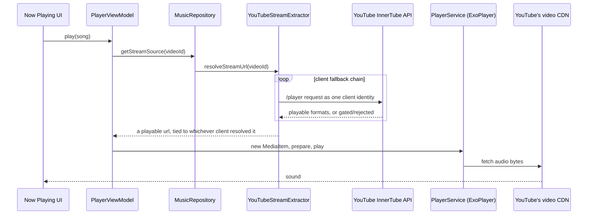
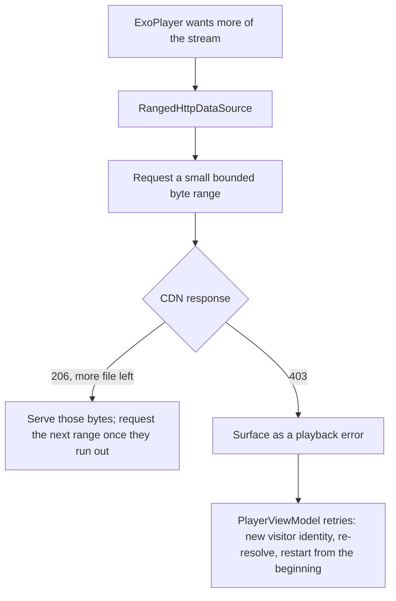

# Resona module architecture

Resona is split into nine Gradle modules so that frontend work (feature
screens, design system) can happen without touching or understanding the
backend (networking, database, playback engine).

## Module graph

Arrows point from a module to what it depends on. Nothing points back up:
`:core:domain` depends on nothing, and no `:feature:*` module depends on
another `:feature:*` module or on `:core:data` directly.

## Modules

| Module | Type | Depends on | Contains |
|---|---|---|---|
| `:app` | Android application | everything | `MainActivity`, `ResonaApplication`, `NavGraph`/`Destinations`, the three Hilt `@Module`s (`AppModule`, `NetworkModule`, `RepositoryModule`) |
| `:core:domain` | Kotlin/JVM (no Android) | — | `Song`, `HomeFeed`/`HomeFeedSection`/`ArtistSpotlight`, `DownloadedSong`, `MusicRepository` interface, `StreamSource`, `PlaybackUnavailableException`/`StreamCipherRequiredException` |
| `:core:data` | Android library | `:core:domain` | InnerTube/Ktor networking (`InnerTubeApi`, response models), `MusicRepositoryImpl`, `extractor/` (stream URL resolution, see `NOTICE.md`), and `download/` (`SongDownloader`, `DownloadedSongsStore`, which fetch and persist offline copies of a resolved stream). Room would live here too if or when it's added. |
| `:core:player` | Android library | `:core:domain` | `PlayerService` (ExoPlayer + MediaSession foreground service), `PlayerViewModel`/`PlayerUiState`/`DownloadState`, `PlaybackDataSourceModule` |
| `:core:ui` | Android library (Compose) | — | Theme, colors, typography, shapes, shared composables (`ResonaFilledButton`, `ResonaOutlinedButton`, `ResonaPlaceholderScreenContent`) |
| `:feature:home` | Android library (Compose) | `:core:domain`, `:core:ui` | `HomeScreen`, `HomeViewModel` |
| `:feature:search` | Android library (Compose) | `:core:domain`, `:core:ui`, `:core:player` | `SearchScreen`, `SearchViewModel` |
| `:feature:player` | Android library (Compose) | `:core:domain`, `:core:ui`, `:core:player` | `NowPlayingScreen`, `MiniPlayerBar` |
| `:feature:library` | Android library (Compose) | `:core:domain`, `:core:ui` | `LibraryScreen`, `LibraryViewModel` |

`:core:domain` is a plain `kotlin("jvm")` module, not an Android library,
so it cannot reference `android.*` or `androidx.*` at all. That's what
actually enforces "zero Android framework dependencies" rather than just
documenting it.

## Enforced dependency rules

1. **Feature modules never depend on `:core:data`.** They only see
   `MusicRepository` (the interface, from `:core:domain`), never
   `MusicRepositoryImpl`, `InnerTubeApi`, or anything network/database-shaped.
   Gradle enforces this the same way it enforces any other missing
   dependency: if a `:feature:*` module tries to import something from
   `:core:data`, it won't compile until someone adds that dependency edge,
   which should be a deliberate, reviewable decision, not an accident.
2. **`:core:domain` has zero Android dependencies**, enforced by it being a
   `kotlin("jvm")` module rather than `com.android.library`. There's no
   Android SDK on its compile classpath to accidentally depend on.
3. **Only `:app` wires domain interfaces to their concrete implementations.**
   `RepositoryModule` (binds `MusicRepositoryImpl` to `MusicRepository`) and
   `NetworkModule` (builds the actual Ktor `HttpClient`) both live in `:app`,
   even though the classes they reference live in `:core:data`. This is the
   one place the "backend" and "frontend" sides of the graph are explicitly
   wired together.

   Two nuances worth knowing:

   - `:core:data`, `:core:player`, `:feature:home`, `:feature:search`, and
     `:feature:library` still each have Hilt's `kapt`/`hilt-android` applied,
     because `MusicRepositoryImpl`, `InnerTubeApi`, `PlayerViewModel`,
     `HomeViewModel`, `SearchViewModel`, and `LibraryViewModel` all use
     `@Inject constructor`/`@HiltViewModel`, and Dagger's annotation processor
     has to run in the module where those are *declared* to generate their
     factory classes. That's different from *wiring* (deciding which
     concrete class satisfies which interface via `@Module`), which is what
     stays exclusive to `:app`.
   - `:core:data` has two `@Module`s of its own: `extractor/ExtractorModule.kt`
     binds `JsEngine` to `WebViewJsEngine`, and `download/DownloadModule.kt`
     binds `SongDownloader`/`DownloadedSongsStore` to their implementations.
     Neither breaks the rule above because none of the four are a
     domain-to-data seam. They're not domain concepts at all, just internal
     details of how `:core:data` resolves a stream URL or persists a
     downloaded file, and no feature module or `:app` code ever needs to see
     them. The rule is really about keeping the domain/implementation
     boundary (the thing feature modules are shielded from) wired in one
     place, not "literally every `@Binds` anywhere must live in `:app`."
   - `:core:player` similarly has `PlaybackDataSourceModule.kt`, providing a
     single `@Singleton DefaultHttpDataSource.Factory` shared by
     `PlayerService` (which builds ExoPlayer with it) and `PlayerViewModel`
     (which updates its User-Agent per track, see `StreamSource`'s kdoc in
     `:core:domain` for why a bare URL isn't enough to actually stream from
     YouTube's CDN). Same reasoning as `ExtractorModule`: a Media3 plumbing
     detail, not a domain-to-data seam.

## Package names vs. module paths

Kotlin package names were **not** renamed as part of this split.
`com.resona.music.domain.model.Song` still lives at that same package, just
physically inside `:core:domain` now instead of `:app`. Only each module's
Gradle/AGP `namespace` (used for that module's own generated `R` class) is
distinct, e.g. `:core:player`'s is `com.resona.music.core.player`, even
though the Kotlin files inside it are still `package com.resona.music.playback`.
This was a deliberate choice to keep the diff to "move files, fix the
handful of resource imports that crossed a module boundary" rather than
rewriting every import in the codebase; a full package rename is possible
later but is a separate, much larger change.

## How playback actually works

Resona has no server and no official API key. Every song comes directly
from YouTube's own private JSON API, InnerTube, the same one youtube.com
and the YouTube apps use internally. There is no login and no persistent
account, just a single anonymous session identity that gets minted the
first time it's needed.

### Resolving a stream

Tapping a song does not hand ExoPlayer a URL that was sitting around
somewhere. It triggers a live resolve, right before playback starts:

`YouTubeStreamExtractor` (`:core:data`) tries a short list of InnerTube
client identities in order (an Android VR client first, then plain
Android, a TV embed, iOS, mobile web, and full web, in that order) because
anonymous, keyless access to YouTube isn't guaranteed for any single one
of them. Which clients actually work anonymously shifts over time as
YouTube tightens or loosens access, so the list is a fallback chain, not a
single fixed choice. Whichever client succeeds also decides the
User-Agent the player has to send afterward, since a stream url is tied to
the client that resolved it.

Every one of those requests carries a visitor identity, an anonymous token
YouTube hands out to anyone browsing without an account. It's cached and
reused for the whole session rather than re-minted per request, since
constantly showing up as a brand new first-time visitor is itself a
signal anti-abuse systems watch for.

### Why playback retries instead of just failing

Two things can go wrong after a url resolves successfully:

- The chosen visitor identity can turn out to be one YouTube's systems
  don't trust, in which case the CDN will refuse to serve the file it
  just told the client it could have.
- A request can ask for more of the file than that identity is currently
  allowed, which the CDN also refuses.

Either way, ExoPlayer sees an HTTP error, not Resona's own code, since
resolving the url and actually fetching its bytes are two separate steps
against two different parts of YouTube's infrastructure. When that
happens, `PlayerViewModel` mints a replacement visitor identity and
re-resolves the track from scratch rather than simply giving up, capped
at a handful of attempts so a genuinely unplayable video still surfaces a
real error instead of retrying forever.

### Fetching in small pieces, not one big request

Progressive playback still fetches in bounded byte ranges rather than one
open-ended request, via `RangedHttpDataSource` (`:core:player`): it asks
for a modest range and quietly opens the next one as playback needs more,
instead of the single unbounded request ExoPlayer would otherwise make.

### A CDN ceiling that turned out to be about the client, not the request

For a while, requests past roughly the first megabyte of a resolved url
were getting flatly rejected, no matter how the request was shaped: fresh
visitor identity, a reused connection instead of a new one, spacing
requests further apart, even aligning a request to the file's own real
internal chunk boundaries (these audio files are DASH-fragmented WebM
with a genuine index describing exactly where each chunk starts) or
attaching a real, correctly-generated cryptographic proof-of-origin
token. None of it moved the ceiling. Seeking past the buffered point,
resuming a track after a drop instead of restarting it, and finishing a
full download all ran into the same wall.

What actually explained it: the two clients tried first (an Android VR
client and an iOS client) are the two best known "no login, no PO token
needed" identities in the whole YouTube-reverse-engineering space, which
most likely means they're also the two identities anti-abuse enforcement
watches hardest, since every scraping tool documents them the same way.
Requesting the exact same byte ranges that were getting rejected, through
a far less common client identity instead, worked cleanly every time,
across multiple different videos, covering entire files with nothing
held back.

`YouTubeStreamExtractor`'s client chain now tries that client first (see
`InnerTubeClientConfig` in `:core:data` for which one and the measurements
behind it). Confirmed live afterward: a track played continuously for
three minutes straight through the point that used to fail every time,
scrubbing forward far past whatever was already buffered landed cleanly
with no stall, and a full download completed in one pass with no rejected
range anywhere.

None of the mechanisms above were wasted effort. The ranged fetching, the
retry-with-a-fresh-identity logic, and the exclusion-clearing fix are all
still exactly what recovers a track if a video ever resolves through one
of the more heavily-watched clients anyway (a genuinely gated video, or a
future tightening that catches up with today's better client too, since
which identities anonymous access still favors is exactly the kind of
thing that shifts over time). They just aren't the whole story for why a
track fails, the client choice was.
